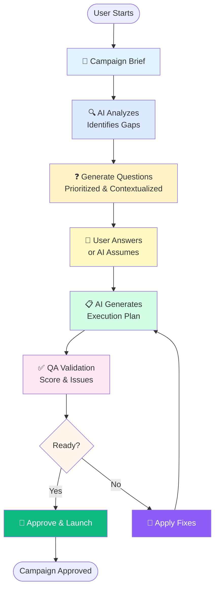

# Campaign Management AI Agent

An AI-powered tool that helps campaign managers transform ambiguous campaign briefs into structured execution plans, with automated QA validation before launch.

**Transform days of meetings into minutes of AI-powered planning.**

## 🎯 Features

### **4-Stage AI Workflow**

#### **1. Brief Analysis** 📝
- Analyzes campaign briefs to identify what's missing, unclear, or under-specified
- Detects gaps like vague channels ("social media" without specifying platforms), missing budgets, or timeline without milestones
- Generates contextualized, specific questions that a campaign manager would ask in a kick-off meeting
- Questions are prioritized (Critical → High → Medium → Low) and mostly multiple-choice for quick answering

#### **2. Interactive Clarification** ❓
- User answers AI-generated questions or skips them (AI makes documented assumptions)
- Most questions have multiple-choice options - just click instead of typing
- Fills information gaps that normally require 2-3 hours of meetings
- Smart enough to ask "Should LinkedIn target VP-level or Director-level roles?" instead of generic "Who is your audience?"

#### **3. Plan Generation** 📋
- Creates a complete, executable campaign plan with:
  - **Channel Specifications**: Platform details, audience segments, content formats, copy guidance, frequency, budget, KPIs, and owners
  - **Week-by-Week Timeline**: Milestones with deliverables, dependencies, and approval cycles
  - **Budget Breakdown**: Total, per-channel allocations, production costs, and contingency
  - **Copy Guidelines**: Tone, key messages, prohibited terms, and CTAs per audience segment
  - **Success Metrics**: Both leading (engagement, clicks) and lagging (conversions, revenue) indicators
  - **Pre-Launch Checklist**: UTM parameters, audience targeting verification, legal review
  - **Assumptions Documentation**: Transparent about what was inferred vs. stated

#### **4. QA Validation** ✅
- Compares execution plan against original brief to catch misalignments before launch
- Identifies issues by severity (Critical, High, Medium, Low):
  - Audience targeting mismatches
  - Missing or wrong channels
  - Budget inconsistencies
  - Timeline conflicts
  - Message tone misalignment
  - Success metric gaps
  - Constraint violations
- Provides alignment score (0-100) and "Ready to Launch" decision
- Suggests specific fixes for each issue
- Also highlights what the plan does well

### **⏱️ Time Savings**

| Traditional Process | With LaunchPilot | Time Saved |
|---------------------|------------------|------------|
| 2-3 hours (kick-off meetings) | 2 minutes (answer AI questions) | **~90% faster** |
| 4-8 hours (creating execution plan) | 30 seconds (AI generation) | **~95% faster** |
| 1-2 hours (manual QA review) | 15 seconds (AI validation) | **~98% faster** |
| **Total: 8-13 hours** | **Total: ~3 minutes** | **From days to minutes** |

## 🔄 Workflow Diagram

The complete campaign planning workflow from brief submission to launch approval:



**Key Workflow Steps:**
1. **Brief Submission** → User provides campaign details
2. **AI Analysis** → Identifies gaps and ambiguities (2-5 seconds)
3. **Question Generation** → Creates contextualized, prioritized questions
4. **User Interaction** → Answer questions or skip (AI documents assumptions)
5. **Plan Generation** → AI creates complete execution plan (30 seconds)
6. **QA Validation** → Compares plan vs brief, calculates alignment score (15 seconds)
7. **Decision Point** → If ready (score ≥80), approve & launch; otherwise apply fixes and regenerate
8. **Launch** → Campaign plan approved with celebration 🎉

## 🏗️ Architecture

```
campaign-management-ai/
├── backend/          # FastAPI backend with Azure OpenAI integration
│   ├── main.py       # FastAPI app with API routes
│   ├── models/       # Pydantic data schemas
│   ├── services/     # Business logic (analyzer, generator, validator)
│   └── prompts/      # AI prompt templates
└── frontend/         # React + TypeScript frontend
    ├── src/
    │   ├── components/  # React components
    │   ├── services/    # API client
    │   ├── types/       # TypeScript definitions
    │   └── data/        # Sample briefs
    └── public/
```

## 🚀 Getting Started

### Prerequisites

- Python 3.10+
- Node.js 18+
- Azure OpenAI account with GPT-4 deployment

### Backend Setup

1. **Navigate to backend directory**
   ```powershell
   cd backend
   ```

2. **Create virtual environment**
   ```powershell
   python -m venv venv
   ```

3. **Install dependencies**
   ```powershell
   .\venv\Scripts\pip.exe install -r requirements.txt
   ```

4. **Configure environment variables**
   
   Create a `.env` file in the `backend` directory with your Azure OpenAI credentials:
   ```env
   AZURE_OPENAI_ENDPOINT=https://your-resource.openai.azure.com/
   AZURE_OPENAI_API_KEY=your-api-key-here
   AZURE_OPENAI_DEPLOYMENT_NAME=gpt-4
   AZURE_OPENAI_API_VERSION=2024-12-01-preview
   CORS_ORIGINS=http://localhost:3000
   ```
   
   **OR** use Azure Default Credentials (Managed Identity/Azure CLI):
   ```env
   AZURE_OPENAI_ENDPOINT=https://your-resource.openai.azure.com/
   AZURE_OPENAI_DEPLOYMENT_NAME=gpt-4
   # No API key needed - uses DefaultAzureCredential
   ```

5. **Run backend server**
   ```powershell
   # Run directly using Python from virtual environment
   .\venv\Scripts\python.exe main.py
   ```
   
   Backend runs at: `http://localhost:8000`  
   API docs: `http://localhost:8000/docs`
   
   **Note:** If you see script execution policy errors, use the path to Python directly from the venv as shown above.

### Frontend Setup

1. **Navigate to frontend directory**
   ```powershell
   cd frontend
   ```
# For Windows PowerShell with execution policy restrictions
   Set-ExecutionPolicy -ExecutionPolicy Bypass -Scope Process -Force
   npm run dev
   ```
   
   Frontend runs at: `http://localhost:3000`
   
   **Note:** The execution policy command allows npm to run for this PowerShell session only. It's safe and doesn't permanently change your system settings.
   ```

3. **Run development server**
   ```powershell
   npm run dev
   ```
   
   Frontend runs at: `http://localhost:3000`

## 📋 API Endpoints

### `POST /api/analyze-brief`
Analyzes a campaign brief and returns clarifying questions.

**Request:**
```json
{
  "brief": {
    "campaign_name": "Q3 Enterprise Push",
    "business_objective": "Convert 200 trial accounts...",
    "target_audience": "VP of Operations at 1000+ employee companies",
    ...
  }
}
```

**Response:**
```json
{
  "questions": [...],
  "gaps_identified": [...],
  "ready_to_plan": false
}
```

### `POST /api/generate-plan`
Generates an execution plan from brief and answers.

**Request:**
```json
{
  "brief": {...},
  "answers": [
    {"question_id": "q1", "answer": "LinkedIn and Instagram"}
  ]
}
```

**Response:**
```json
{
  "campaign_name": "Q3 Enterprise Push",
  "executive_summary": "...",
  "channels": [...],
  "timeline": [...],
  "budget": {...},
  ...
}
```

### `POST /api/validate-plan`
Validates plan against brief to identify misalignments.

**Request:**
```json
{
  "brief": {...},
  "plan": {...}
}
```

**Response:**
```json
{
  "overall_alignment_score": 85,
  "summary": "...",
  "misalignments": [...],
  "ready_to_lau (End-to-End Walkthrough)

### **Step 1: Submit Campaign Brief**
1. Open `http://localhost:3000` in your browser
2. Click **"Load B2B SaaS Sample"** to auto-fill a sample brief (or fill manually)
3. Review the brief fields:
   - Campaign Name: "Q3 Enterprise Trial-to-Paid Push"
   - Business Objective: "Convert 200 enterprise trial accounts..."
   - Target Audience, Key Message, Channels, Budget, Timeline, etc.
4. Click **"Analyze Brief & Continue"**
5. AI processes the brief (5-10 seconds)

### **Step 2: Answer Clarifying Questions**
1. AI returns 6-8 questions identifying gaps in your brief
2. Example questions:
   - *"The brief mentions 'social channels' - should this include LinkedIn, Instagram, both, or other platforms?"*
   - *"What is the preferred tone for campaign messaging?"*
   - *"Should we segment audiences by company size or industry?"*
3. Questions are prioritized (Critical/High shown first)
4. **Answer by clicking options** (most questions have multiple-choice)
5. Or **skip questions** - AI will make reasonable assumptions
6. Click **"Generate Execution Plan"**
7. AI generates plan (15-30 seconds)

### **Step 3: Review Execution Plan**
1. See complete execution plan with expandable sections:
   - **Executive Summary**: Strategy overview
   - **Channels**: LinkedIn Sponsored Content (with target audience, format, copy guidance, budget, KPIs)
   - **Timeline**: Week-by-week milestones with deliverables
   - **Budget Breakdown**: $50K total with per-channel allocations
   - **Copy Guidelines**: Tone and messaging per audience segment
   - **Success Metrics**: Conversion rates, demo requests, engagement metrics
   - **Assumptions Made**: Transparent about AI's inferences
2. Review each section - this is what your team will execute from

### **Step 4: Run QA Validation**
1. Click **"Run QA Validation"** 
2. AI compares plan against your original brief (10-15 seconds)
3. See results:
   - **Alignment Score**: 85/100 (example)
   - **Issues by Severity**: 0 Critical, 2 High, 3 Medium, 1 Low
   - **Detailed Issue List**:
     ```
     ❌ HIGH: Target audience mismatch on LinkedIn channel
     Brief says: "VP of Operations"
     Plan says: "Director of Revenue Operations"
     Impact: Will reach wrong decision-making level
     Fix: Update LinkedIn targeting to VP-level roles
     ```
   - **Strengths**: What the plan does well
   - **Ready to Launch**: Yes/No decision
4. Review issues and fix plan before launch

### **Step 5: Export & Handoff**
1. Click **"Export JSON"** to download the plan
2. Share with copywriters, designers, channel managers
3. No additional clarification meetings needed - everything is documentedlarifying questions
3. **Answer Questions** - Provide answers or skip to generate plan with assumptions
4. **Review Plan** - See detailed execution plan with channels, timeline, budget
5. **Run QA** - Validate plan against brief, see alignment score and issues
6. **Export** - Download plan as JSON for handoff

## 🛠️ Tech Stack

**Backend:**
- FastAPI - Modern Python web framework
- Azure OpenAI - GPT-4 for reasoning and generation
- Pydantic - Data validation and serialization
- Python-dotenv - Environment configuration

### **Backend Issues**

**"Access denied due to Virtual Network/Firewall rules" (Error 403):**
- Your Azure OpenAI resource has network restrictions
- Either:
  - Add your IP to the allowed list in Azure Portal
  - Remove network restrictions (if allowed by your org)
  - Use Azure CLI authentication: `az login` and use DefaultAzureCredential

**Backend won't start:**
- Check Azure OpenAI credentials in `.env`
- Ensure Python 3.10+ is installed: `python --version`
- Verify all dependencies: `.\venv\Scripts\pip.exe list`
- Check if port 8000 is available: `netstat -ano | findstr :8000`

**"Response content is None" errors:**
- Check your Azure OpenAI deployment name matches the `.env` file
- Verify API version is compatible: `2024-12-01-preview` or later
- Check OpenAI response logs for content filtering or token limits

**PowerShell script execution errors:**
- Don't use `.\venv\Scripts\Activate.ps1` if you get security errors
- Instead run: `.\venv\Scripts\python.exe main.py` directly

### **Frontend Issues**

**Frontend won't start:**
- Delete `node_modules` and `package-lock.json`
- Run `npm install` again
- Check that backend is running on port 8000

**"npm command not found" or execution policy errors:**
- Run PowerShell as Administrator
- Execute: `Set-ExecutionPolicy -ExecutionPolicy Bypass -Scope Process -Force`
- Then run: `npm run dev`

**CORS errors in browser console:**
- Ensure backend `.env` has: `CORS_ORIGINS=http://localhost:3000`
- Restart backend after changing `.env`

**API calls failing (network errors):**
- Check backend is running: Visit `http://localhost:8000/health`
- Check browser console for specific error messages
- Verify frontend is calling correct backend URL

### **Common Azure OpenAI Issues**

**401 Unauthorized:**
- API key is incorrect or expired
- Check `.env` file has correct `AZURE_OPENAI_API_KEY`

**404 Not Found:**
- Deployment name is incorrect
- Check `.env` file has correct `AZURE_OPENAI_DEPLOYMENT_NAME`
- Verify deployment exists in Azure Portal

**429 Rate Limit:**
- Too many requests to Azure OpenAI
- Wait a few seconds and retry
- Consider increasing quota in Azure Portal

## 🚀 Quick Start (TL;DR)

```powershell
# Terminal 1 - Backend
cd backend
.\venv\Scripts\python.exe main.py

# Terminal 2 - Frontend  
cd frontend
Set-ExecutionPolicy -ExecutionPolicy Bypass -Scope Process -Force
npm run dev

# Open browser: http://localhost:3000
```

## 📈 Use Cases

- **B2B SaaS**: Trial-to-paid conversion campaigns targeting enterprise decision-makers
- **B2C Retail**: Seasonal promotions and re-engagement campaigns
- **Product Launches**: Multi-channel launch campaigns with coordinated messaging
- **Event Marketing**: Conference/webinar promotion with integrated channels
- **Demand Generation**: Lead generation campaigns with nurture sequences

## 🔒 Security & Privacy

- All data stays between your browser, your server, and Azure OpenAI
- No data is stored permanently (except localStorage for session management)
- Campaign briefs and plans are not logged or retained by the application
- Use environment variables for sensitive credentials (never commit to git)

## 📝 License

This project is for hackathon/demonstration purposes.

Two sample campaign briefs are included:

1. **B2B SaaS** - Enterprise trial-to-paid conversion campaign
2. **B2C Retail** - Summer re-purchase drive for Home & Garden

These demonstrate the tool's ability to handle different campaign types and complexities.

## ⚙️ Configuration

### Backend Environment Variables

- `AZURE_OPENAI_ENDPOINT` - Your Azure OpenAI endpoint URL
- `AZURE_OPENAI_API_KEY` - Your Azure OpenAI API key
- `AZURE_OPENAI_DEPLOYMENT_NAME` - GPT-4 deployment name (default: `gpt-4`)
- `AZURE_OPENAI_API_VERSION` - API version (default: `2024-02-15-preview`)
- `CORS_ORIGINS` - Allowed frontend origins (default: `http://localhost:3000`)

### Frontend Environment Variables (Optional)

Create `frontend/.env`:
```
VITE_API_URL=http://localhost:8000
```

## 🧪 Testing

### Backend Testing
```powershell
cd backend
# Test health endpoint
curl http://localhost:8000/health

# Test with sample brief (using API docs)
# Navigate to http://localhost:8000/docs
# Try the /api/analyze-brief endpoint
```

### Frontend Testing
1. Open `http://localhost:3000`
2. Load a sample brief
3. Follow the workflow through to QA validation

## 🐛 Troubleshooting

**Backend won't start:**
- Check Azure OpenAI credentials in `.env`
- Ensure Python 3.10+ is installed
- Verify all dependencies are installed: `pip list`

**Frontend won't start:**
- Delete `node_modules` and `package-lock.json`, run `npm install` again
- Check that backend is running on port 8000
- Clear browser cache

**AI responses are slow:**
- Normal for GPT-4 (10-30 seconds for plan generation)
- Check Azure OpenAI quota and rate limits
- Review prompt complexity in `backend/prompts/`

**CORS errors:**
- Verify `CORS_ORIGINS` in backend `.env` includes `http://localhost:3000`
- Check that backend is actually running

## 📝 License

This project is for hackathon/educational purposes.

## 👥 Contributing

This is a hackathon project. For production use, consider:
- Adding authentication
- Database integration for persisting briefs/plans
- Multi-user collaboration features
- Advanced analytics and reporting
- Integration with marketing platforms (LinkedIn, Google Ads, etc.)

## 🎯 Future Enhancements

- [ ] Plan editing and regeneration of specific sections
- [ ] Multi-turn clarification (follow-up questions)
- [ ] Auto-fix for QA issues
- [ ] Export to PDF/DOCX
- [ ] Campaign templates library
- [ ] Historical brief/plan analysis
- [ ] Integration with project management tools (Asana)
- [ ] Real-time collaboration for team review

---
